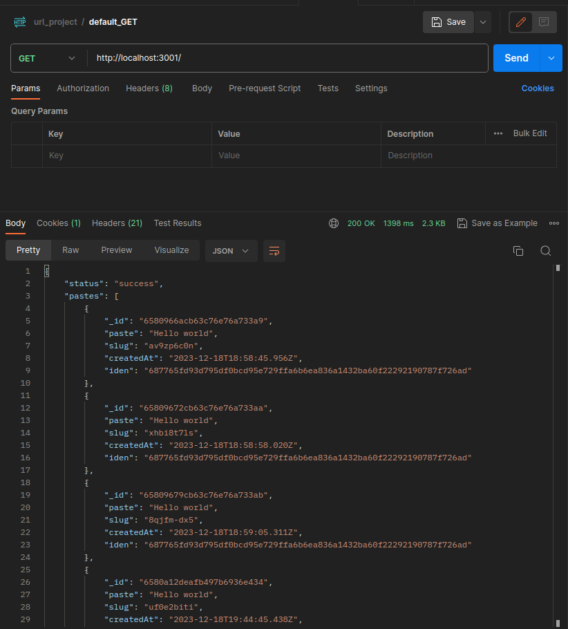

# PasteBin - Simple and Secure Paste Sharing

This project implements a simple and secure paste bin service using Node.js and MongoDB. It allows users to create and share text pastes with a unique identifier. The pastes are stored securely in a MongoDB database, and each paste has an expiration time to ensure data cleanliness.

## Features

- **Secure Hashing**: Unique hashing for id's of paste is performed using the SHA-256 algorithm, ensuring the security of stored data and easy retrival of paste.
- **Session Management**: Utilizes Express.js sessions (express-session) and MongoDB as a session store for managing user sessions and ensuring a smooth user experience.
- **Expiration of Pastes**: Automatically deletes pastes that have exceeded their configured expiration time (default is 1 week), promoting data hygiene.
- **Error Handling**: Implements error handling for a robust and user-friendly application.

## Technologies Used

- **Node.js**: Backend server environment for handling HTTP requests and business logic.
- **Express.js**: Web application framework for building robust and scalable web applications.
- **MongoDB**: NoSQL database for storing paste data securely.
- **Yup**: Schema validation library for validating incoming data.
- **Helmet**: Express.js middleware for securing HTTP headers.
- **Cors**: Middleware for handling Cross-Origin Resource Sharing (CORS).
- **Morgan**: HTTP request logger middleware for Node.js.
- **Nanoid**: Library for generating unique and secure IDs.
- **Mongoose**: MongoDB object modeling for Node.js.
- **Connect-Mongo**: Session store for Express.js, using MongoDB as the storage backend.

## Getting Started

1. Install dependencies:

   ```bash
   npm install
   ```
2. Set up your environment variables by creating a `.env` file with the following:

   ```env
   MONGO_URI=<Your MongoDB Connection URI>
   SECRET=<Your Session Secret>
   PORT=<Your Desired Port>
   DAYS=<Number of Days for Paste Expiration>
   ```
3. Run the application:

   ```bash
   npm run dev
   ```
4. Access the application at `http://localhost:<PORT>`

## API Endpoints

- `POST /createPaste`: Create a new paste, returns a json of the paste created, slug(id), time of creation and session identityExample:
- - 


- `GET /getPaste/:id`: Retrieve a paste by its unique identifier, returns same response as above.
  Example:
  - 


- `GET /`: Retrieve pastes associated with the current session, returns a list of jsons related to that specific users session
  Example:
  -  

## Contribution

Feel free to contribute to the project by opening issues or submitting pull requests. Your feedback and contributions are highly appreciated.

## License

This project is licensed under the MIT License - see the [LICENSE](LICENSE) file for details.
